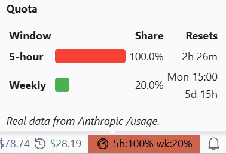
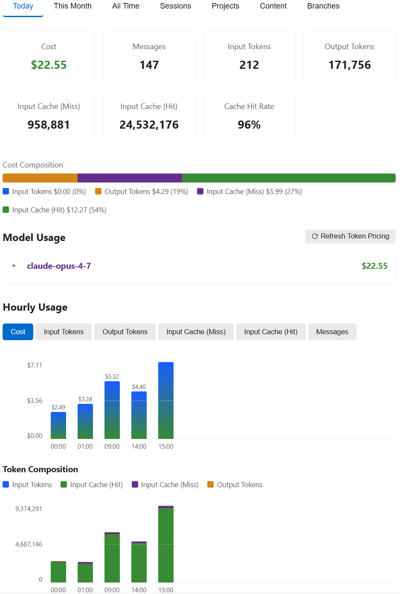

# Claude Code Usage

🌐 **Language**: [🏠 Main](README.md) | **English** | [繁體中文](README-zh-TW.md) | [简体中文](README-zh-CN.md) | [日本語](README-ja.md) | [한국어](README-ko.md)

---

**The Claude Code coach in your status bar.** Not a billing tool. Not a multi-provider monitor. A focused token tracker that uses AI to help you use Claude Code better.

> **What it is:** a VS Code status-bar monitor that reads your local Claude Code conversation logs and shows **token-derived** usage and cost estimates — plus an optional AI advisor that suggests how to improve your prompts and reduce waste.
>
> **What it is _not_:** a billing tool. All amounts are estimates based on public per-million-token rates. Refer to your Anthropic account for actual charges.

> Screenshots are from the English UI. See the [main README](README.md) for the full feature reference.

## Screenshots

### Status bar


Hover the quota indicator for a breakdown:



### Dashboard



## Features

- **Status bar** — today's cost, current-session cost, and real 5-hour / weekly quota (`5h:N% wk:N%`) read from Claude Code's own OAuth session. Zero configuration.
- **Dashboard tabs** — Today / This Month / All Time, plus **Sessions / Projects / Content / Branches**, all sortable.
- **Stacked cost-composition charts** with a Y-axis and reference lines — see at a glance how much of each day / month went to input, output, cache-write and cache-read.
- **Content tab** — estimates which content consumes your tokens (your prompts vs. tool results vs. assistant output / thinking).
- **AI advice** (opt-in) — sends a usage summary plus a sample of your prompts to an OpenAI-compatible API (DeepSeek V4 Pro by default) and suggests concrete rewrites. Bring your own key, or preview a static demo first.
- **Multi-vendor pricing** — Opus 4.x / Sonnet 4.x / Haiku 4.5 verified against Anthropic's public pricing; reference rates for OpenAI / Gemini / DeepSeek / Kimi / GLM / Qwen with family-aware fallback. `Refresh Token Pricing` pulls live LiteLLM data.
- **Personalisation** — language, timezone, decimal places, compact numbers, project grouping, dashboard auto-refresh toggle.

## Install

Search for **`Claude Code Usage`** in the Extensions view (`Ctrl+Shift+X`), or:

```
ext install GrowthJack.claude-code-usage
```

Also on the [Open VSX Registry](https://open-vsx.org/extension/GrowthJack/claude-code-usage) for Cursor / Windsurf.

## Configuration

Open Settings (`Ctrl+,`) and search for **`Claude Code Usage`**. All settings are optional. The most useful:

- `language` — UI language (`auto` / `en` / `zh-TW` / `zh-CN` / `ja` / `ko`).
- `timezone` — IANA timezone for date display (e.g. `Asia/Hong_Kong`).
- `usageLimitTracking` — show the real 5h / weekly quota indicator.
- `showCost` / `showContext` — toggle the cost item and the context-window fill indicator (like `/context`) in the status bar.
- Each of these status-bar items is opt-out — set `usageLimitTracking`, `showCost`, or `showContext` to `false` to hide just that one.
- `advice.apiKey` — API key for the AI advice feature (OpenAI-compatible).
- `pauseDashboardRefresh` — pause dashboard auto-refresh (also toggleable in the dashboard header).

See the [full settings table in the main README](README.md#configuration).

## Troubleshooting

**"No Claude Code Data"** — make sure Claude Code is installed and used at least once; check the `dataDirectory` setting (auto-detection looks at `~/.claude/projects`).

**Quota shows `5h:--% wk:--%`** — log in to Claude Code once; the extension reads `~/.claude/.credentials.json` read-only.

**Usage history is missing older months** — Claude Code deletes logs older than `cleanupPeriodDays` (default 30). To keep more, set `{ "cleanupPeriodDays": 365 }` in `~/.claude/settings.json`. Already-deleted logs can't be recovered.

**Token counts lower than your provider's dashboard** — some proxies / dynamic workflows write per-agent records to sub-directories that may be incomplete. Your actual spend is on your provider's billing page. Native workflow attribution is planned.

## Credits

Forked from [`jack21/ClaudeCodeUsage`](https://github.com/jack21/ClaudeCodeUsage). MIT-licensed. Community contributions credited in [CHANGELOG.md](CHANGELOG.md). Many code changes drafted with [Claude Code](https://claude.com/claude-code).

**Issues, PRs and ideas are warmly welcomed** — that's how the project grows.

## License

[MIT](LICENSE)
