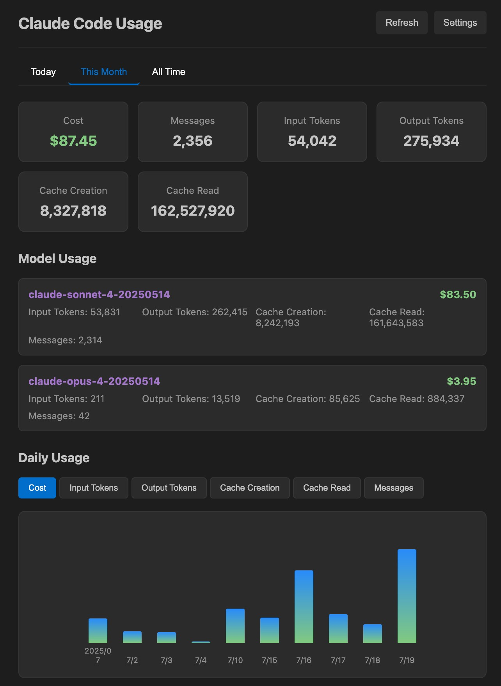

# Claude Code 使用量モニター

🌐 **Language | 語言 | 言語 | 언어**: [🏠 Main](README.md) | [English](README-en.md) | [繁體中文](README-zh-TW.md) | [简体中文](README-zh-CN.md) | **日本語** | [한국어](README-ko.md)

---

Claude Code の使用量とコストを詳細な分析とインタラクティブな視覚化で監視する包括的な VSCode 拡張機能です。

## 🖼️ スクリーンショット

### ステータスバー

### ダッシュボード

## ✨ 機能

### 📊 リアルタイム監視
- **ステータスバー表示**：VSCode ステータスバーに今日の使用コストを表示
- **ライブ更新**：設定可能な間隔（最小30秒）での自動データ更新
- **依存関係ゼロ**：ネイティブ Node.js モジュールを使用し、最大の互換性を実現

### 📈 インタラクティブ分析ダッシュボード
- **複数の時間ビュー**：今日、今月、すべての時間の視点
- **インタラクティブチャート**：6つの異なる指標を切り替え可能な棒グラフ：
  - コスト分析
  - 入力/出力トークン
  - キャッシュ作成/読み取りトークン
  - メッセージ数
- **詳細テーブル**：包括的な日次/月次使用量の内訳
- **モデル分析**：モデル別のコストとトークン消費の追跡

### 🌐 多言語サポート
- **5言語**：English, 繁體中文, 简体中文, 日本語, 한국어
- **自動検出**：システム言語を自動検出
- **手動オーバーライド**：設定で好みの言語を選択

### 🎨 視覚機能
- **ボトムアップチャート**：業界標準のチャート方向
- **月次トレンド**：すべての時間ビューで月次集計データを表示し、長期トレンド分析に対応
- **VSCode テーマ統合**：ライト/ダークテーマとのシームレスな統合
- **レスポンシブデザイン**：異なる画面サイズに最適化

## インストール

1. VSCode マーケットプレイスから拡張機能をインストール
2. 拡張機能が Claude Code データディレクトリを自動検出
3. Claude Code の使用を開始すると、使用量がステータスバーに表示されます

## 設定

`ファイル > 基本設定 > 設定` から「Claude Code Usage」を検索してアクセス：

- **更新間隔**：使用データを更新する頻度（最小 30 秒）
- **データディレクトリ**：カスタム Claude データディレクトリパス（空欄で自動検出）
- **言語**：表示言語の設定
- **小数点以下の桁数**：コスト表示の小数点以下桁数

## 使用方法

1. **ステータスバー**：パルスアイコン付きで現在のセッションコストを表示
2. **ステータスバーをクリック**：詳細な使用量内訳ポップアップを開く
3. **ポップアップタブ**：現在のセッション、今日、今月のビュー間を切り替え
4. **手動更新**：更新ボタンをクリックしてデータを即座に更新

## 要件

- Claude Code がインストールされ、実行されている必要があります
- VSCode 1.74.0 以降

## トラブルシューティング

拡張機能が「Claude Code データなし」と表示される場合：

1. Claude Code がインストールされ、使用されていることを確認
2. 拡張機能設定でデータディレクトリ設定を確認
3. Claude Code が使用ログを生成していることを確認

## ライセンス

MIT

## 貢献

GitHub リポジトリで Issue や Pull Request を歓迎します。