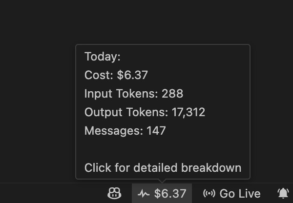
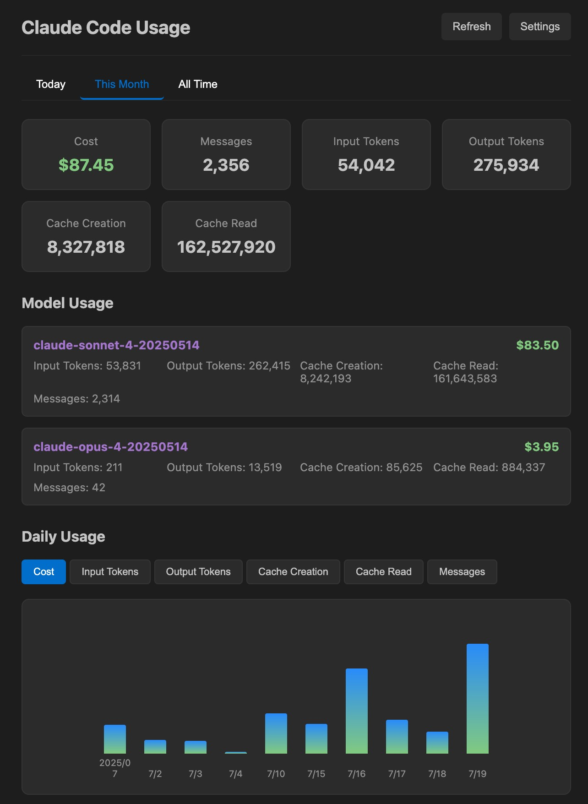

# Claude Code 사용량 모니터

🌐 **Language | 語言 | 言語 | 언어**: [🏠 Main](README.md) | [English](README-en.md) | [繁體中文](README-zh-TW.md) | [简体中文](README-zh-CN.md) | [日本語](README-ja.md) | **한국어**

---

Claude Code 사용량과 비용을 상세한 분석과 인터랙티브 시각화로 모니터링하는 종합적인 VSCode 확장 프로그램입니다.

## 🖼️ 스크린샷

### 상태바

### 대시보드

## ✨ 기능

### 📊 실시간 모니터링
- **상태바 표시**: VSCode 상태바에 오늘의 사용 비용 표시
- **실시간 업데이트**: 설정 가능한 간격(최소 30초)으로 자동 데이터 업데이트
- **의존성 제로**: 네이티브 Node.js 모듈 사용으로 최대 호환성 보장

### 📈 인터랙티브 분석 대시보드
- **다중 시간 뷰**: 오늘, 이번 달, 전체 기간의 관점
- **인터랙티브 차트**: 6가지 다른 지표로 전환 가능한 막대 차트:
  - 비용 분석
  - 입력/출력 토큰
  - 캐시 생성/읽기 토큰
  - 메시지 수
- **상세 테이블**: 포괄적인 일일/월별 사용량 분석
- **모델 분석**: 모델별 비용 및 토큰 소비 추적

### 🌐 다국어 지원
- **5개 언어**: English, 繁體中文, 简体中文, 日本語, 한국어
- **자동 감지**: 시스템 언어 자동 감지
- **수동 설정**: 설정에서 선호 언어 선택

### 🎨 시각적 기능
- **상향식 차트**: 업계 표준 차트 방향
- **월별 트렌드**: 전체 기간 뷰에서 월별 집계 데이터 표시로 장기 트렌드 분석 지원
- **VSCode 테마 통합**: 라이트/다크 테마와의 완벽한 통합
- **반응형 디자인**: 다양한 화면 크기에 최적화

## 설치

1. VSCode 마켓플레이스에서 확장 프로그램 설치
2. 확장 프로그램이 Claude Code 데이터 디렉토리를 자동 감지
3. Claude Code 사용을 시작하면 상태 표시줄에 사용량이 나타납니다

## 설정

`파일 > 기본 설정 > 설정`에서 "Claude Code Usage"를 검색하여 접근:

- **새로고침 간격**: 사용 데이터를 업데이트하는 빈도 (최소 30초)
- **데이터 디렉토리**: 커스텀 Claude 데이터 디렉토리 경로 (비워두면 자동 감지)
- **언어**: 표시 언어 설정
- **소수점 자릿수**: 비용 표시의 소수점 자릿수

## 사용법

1. **상태 표시줄**: 펄스 아이콘과 함께 현재 세션 비용 표시
2. **상태 표시줄 클릭**: 상세한 사용량 분석 팝업 열기
3. **팝업 탭**: 현재 세션, 오늘, 이번 달 보기 간 전환
4. **수동 새로고침**: 새로고침 버튼을 클릭하여 데이터 즉시 업데이트

## 요구사항

- Claude Code가 설치되고 실행 중이어야 합니다
- VSCode 1.74.0 이상

## 문제 해결

확장 프로그램이 "Claude Code 데이터 없음"을 표시하는 경우:

1. Claude Code가 설치되고 사용되었는지 확인
2. 확장 프로그램 설정에서 데이터 디렉토리 설정 확인
3. Claude Code가 사용 로그를 생성하고 있는지 확인

## 라이선스

MIT

## 기여

GitHub 저장소에서 Issue와 Pull Request를 환영합니다.