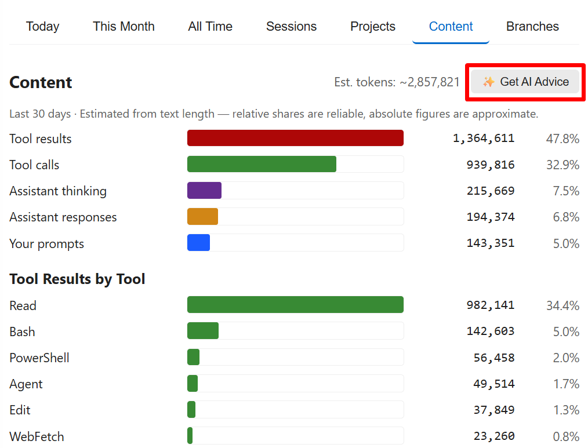
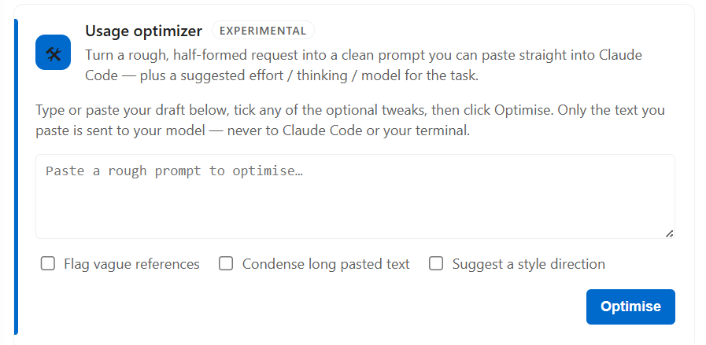

# Claude Code 使用量监控

🌐 **语言**: [🏠 Main](README.md) | [English](README-en.md) | [繁體中文](README-zh-TW.md) | **简体中文** | [日本語](README-ja.md) | [한국어](README-ko.md)

---

**状态栏里的 Claude Code 教练。** 不是账单工具，不是多 provider 监控面板。一个专注 token 精确归因、并用 AI 帮你把 Claude Code 用得更好的轻量 VS Code 插件。

> **它是什么**：一个 VS Code 状态栏小工具，读取本地 Claude Code 对话日志，按 **token × 公开单价**估算用量与成本；并提供可选的 AI 建议，帮你优化提示词、减少浪费。
>
> **它不是什么**：账单工具。所有金额均为估算值（基于公开的每百万 token 单价），实际费用请以 Anthropic 官方账单为准。

> 截图取自英文界面。

---

## 截图

### 状态栏


*今日成本 · 当前 session 成本 · 5 小时和每周配额利用率。*

将鼠标移到配额指示器上看明细：


*来自真实 `/usage` 数据 —— 利用率百分比、重置倒计时，以及每周重置的星期与时间。*

### 仪表板


*点击状态栏打开完整仪表板：堆叠 token 构成图、小时分布、缓存命中率、按 token 类型的成本构成，以及下方的按模型 / 按日表格。*

### Content 标签页 —— 看清 token 究竟花在哪



*估算各类内容的 token 占比 —— 你的提示词 vs 工具结果（按工具）vs 助手输出 / 思考。这是优化使用的着力点，范围为最近 30 天（`advice.promptWindowDays`）。*

### AI 建议 —— 基于你真实用量的一份教练报告

AI 建议生成的是一份 **Markdown 文档**，用文字展示比截图更直观。配好 key（`advice.apiKey`），点 **Get AI advice**（✨ 按钮，或 Content 标签页那张卡），选一个范围（全部项目，或某个项目），它会把你的用量汇总加上一份**你自己的**提示词样本发给你的模型，打开一份按优先级排好的报告。自备 key —— 默认 Anthropic（`/v1/messages`），也支持任意 OpenAI 兼容端点。

返回内容大致是这样（示意）：

> **把指令写得更完整**
> - 有几条提示词只写了「修一下这个 bug」，没说是哪个文件、什么现象，于是第一轮要先去找。开头先点明文件 + 期望行为 vs 实际行为。
>
> **在不牺牲清晰度的地方省 token**
> - 约 38% 的 token 花在 150k 上下文以上。不相关的任务之间用 `/clear`，每次请求都更省。

### 用量优化器



粘进一条粗略、没成形的需求，得到一条干净、**可直接粘贴**的提示词（纯文本、无 Markdown），并附上推荐的 effort / thinking / 模型（以小标签显示）。三个可选开关进一步微调（标出含糊指代 · 压缩长粘贴内容 · 建议风格方向）。实验性，默认关闭；**只发送你粘贴的文字** —— 不碰你的文件、不进终端 —— 且首次有一次性同意确认。

---

## 2.1 新功能

- **工作流标签页** —— 所有多代理运行尽收一处：动态工作流（ultracode）和临时子代理批次，含每次运行的成本、代理数、所用模型、**缓存命中率**（"我的供应商是否适配工作流"的诊断信号），以及按任务内容标注的逐代理明细。
- **用量追踪面板** —— 对标官方 `/usage` 的"用量构成"视图，但支持全部模型 / 供应商和五档范围（日 / 周 / 月 / 会话 / 项目）：>150k 上下文占比、8 小时以上会话占比、子代理密集占比、工作流占比，以及 Skills／子代理／插件／模型四类细分。今日标签页有精简卡片。
- **思考占比** —— 每会话的估算思考 token 占比（Sessions 列 + 今日卡片），过高时提示改用 `/effort`。
- **工作流配额护栏** —— 当 5 小时窗口剩余不足以完成一次运行时，仪表板显示可关闭的警告横幅（`claudeCodeUsage.workflowQuotaWarnPercent`）。
- **设置搬进仪表板** —— 新增 ⚙ 设置标签页，就地管理所有选项；VS Code 原生设置只保留三个适合同步的（`language`、`dataDirectory`、`advice.apiKey`）。右上角按钮精简为 ✨ AI 建议 和 ⚙ 设置（都跳到对应标签）；自动刷新开关挪进设置（暂停时右上角才出现手动 ↻）。如果你把成本、配额、上下文三项**全部隐藏**，状态栏会保留一个小图标作为回到仪表板的入口。
- **状态栏指标**（`statusBarMetric`）—— 默认显示今日成本，也可切换为今日**总 token** 消耗（紧凑 k/M）。
- **每周 Opus 上限**（`showOpusWeekly`，可选开启）—— 在配额项后追加 `opus:NN%`，方便重度 Opus 用户一眼看到每周 Opus 额度。（PR #38，[@wheelbarrel00](https://github.com/wheelbarrel00)。）
- **AI 建议 2.0** —— 自备 key：默认 **Anthropic**（`/v1/messages`），也支持任意 OpenAI 兼容端点（`advice.apiFormat`）。喂入新信号（运行、缓存命中率、归因、思考占比）；可选 `advice.userContext` 会附上"针对本项目的个性化"一节；`advice.promptWindowDays`（默认 30）设定采样窗口。传输层加固：超时、重试、curl 兜底。*（一个免 key 的"订阅"后端做过原型，但本版未上线 —— Anthropic 封禁用 Claude Code 的 OAuth token 直连 API；若日后放开会再启用。）*
- **用量优化器**（实验性，`advice.optimizer.enabled`，默认关闭）—— Content 标签页的一张卡，粘进粗略需求，返回一条精炼提示词，以**纯文本**形式（可直接粘贴、无 Markdown），并附推荐的 effort / thinking / 模型。三个可选微调项（标出含糊指代 · 压缩长粘贴内容 · 建议风格方向）。**只发送你粘贴的文字**，且首次有一次性同意确认。
- **上下文窗口指示器**（实验性，默认关闭）—— 在设置里开启后，状态栏显示当前 session 的上下文占用。`~` 表示窗口大小是猜测；代理 / 自定义模型可用 `contextWindowOverride` 手填真实窗口。

## 2.0 新功能

- **真实的 5 小时和每周配额** 显示在状态栏 —— 读取 Claude Code 现有的 OAuth 会话（`~/.claude/.credentials.json` 或 macOS 钥匙串），无需配置。借鉴上游 [PR #9](https://github.com/ClaudeCodeUsage/ClaudeCodeUsage/pull/9)（[@Dobidop](https://github.com/Dobidop)）。
- **四个新标签页**：Sessions、Projects、Content、Branches，均可排序。
- **堆叠 token 构成图**，含 Y 轴和参考线。
- **AI 建议命令**（默认 DeepSeek V4 Pro，`reasoning_effort=max`），未配置 key 时提供 demo 演示。
- **多厂商定价**：Opus 4.x、Sonnet 4.x、Haiku 4.5 对照 Anthropic 官方定价；OpenAI、Gemini、DeepSeek、Kimi、GLM、Qwen 等代理场景的参考价，含家族感知回退。`Refresh Token Pricing` 可拉取 LiteLLM 即时价格。
- **自定义时区** 用于日期显示（`claudeCodeUsage.timezone`）。
- **浅色主题标签可读性** 修复。
- 全程 **locale 感知的数字与日期**（德语用 `.`，英语用 `,`）。
- **实时状态栏**：基于 `fs.watch`（1.5s 防抖）+ 空闲跳过 + 非阻塞加载（每 25 个文件让出事件循环）。

完整变更：[CHANGELOG.md](CHANGELOG.md)。

---

## 安装

### VS Code Marketplace

在扩展视图（`Ctrl+Shift+X`）搜索 **`Claude Code Usage`**，或：

```
ext install GrowthJack.claude-code-usage
```

### Cursor / Windsurf / Antigravity（Open VSX）

同一扩展也发布在 [Open VSX Registry](https://open-vsx.org/extension/GrowthJack/claude-code-usage)。

### 从 `.vsix` 文件安装

`Ctrl+Shift+P` → **Extensions: Install from VSIX...** → 选择下载的 `.vsix`。

---

## 配置

**绝大多数设置现在都在仪表板里。** 打开仪表板（运行 **Show Usage Details**，或点右上角 ⚙），用 **⚙ 设置**标签页 —— 分为「常规 / 状态栏 / 数据与刷新 / AI 建议与优化器」。改动即时生效。

为了让 VS Code 原生设置 UI 保持清爽，只保留三个设置在那里（以便随 Settings Sync 同步）。打开设置（`Ctrl+,`）搜索 **`Claude Code Usage`**：

| 设置 | 默认 | 作用 |
|---|---|---|
| `language` | `"auto"` | 界面语言：`auto` / `en` / `zh-TW` / `zh-CN` / `ja` / `ko`。 |
| `dataDirectory` | `""` | 自定义 Claude 数据目录；留空 = 自动检测。 |
| `advice.apiKey` | `""` | AI 建议 + 用量优化器的 API key（留空则 AI 建议会打开 demo）。 |

其余全部 —— 刷新间隔、状态栏各项、数字 / 日期格式、项目分组、内容分析，以及所有 AI 建议 / 优化器选项 —— 都在仪表板的 ⚙ 设置标签页里。升级不丢配置：首次启动会做一次性迁移，把你 `settings.json` 里已有的值搬过来。

---

## 成本是如何计算的

状态栏成本为各模型按 **`Σ (tokens × 每百万单价)`** 求和（覆盖输入、输出、缓存写入、缓存读取）。

- **每百万单价** 来自内置定价表，对照 Anthropic 官方定价页验证，并为可能出现在代理场景的非 Anthropic 模型补充参考价。
- **`Refresh Token Pricing`**（命令 + 仪表板按钮）从 [LiteLLM 公开数据集](https://github.com/BerriAI/litellm)拉取即时价格作为运行时覆盖。
- **未知模型快照** 按其所属家族（Opus / Sonnet / Haiku / GPT / Gemini / DeepSeek / Kimi / GLM / Qwen）的当前档位定价，而非盲目回退。

状态栏**不知道**：

- 你实际的 Anthropic 账单（折扣、免费额度、套餐上限）。
- 你的代理供应商是否采用不同费率。
- 任何未记录在本地 `.jsonl` 日志中的内容。

**5h / 每周配额指示器**则不同 —— 它通过 OAuth 会话查询 Claude Code 真实的 `/usage` 端点，显示 Anthropic 为你的账户记录的实际百分比。该数值是权威的。

---

## 隐私

- 所有 token / 成本 / session 分析都在**本地**进行，只读取你的 `~/.claude/projects/**/*.jsonl` 文件。
- 配额指示器用 Claude Code 现有的 OAuth token 调用 **`api.anthropic.com/api/oauth/usage`**，不发送任何额外凭证。
- **AI 建议**和**用量优化器**是仅有的会调用模型的功能 —— 且只在**你**主动触发时。AI 建议发送的是你的用量汇总加上一份近期提示词样本；优化器**只发送你粘贴进去的文字**（不碰你的文件、不进终端），且首次有一次性同意确认。两者都发往 `advice.apiUrl` 指定的端点，用你自己的 `advice.apiKey`（默认 Anthropic `/v1/messages`，也支持任意 OpenAI 兼容端点）。**自备 key**；插件本身不附带任何密钥。

---

## 疑难排解

**"无 Claude Code 数据"**
- 确认 Claude Code 已安装并至少使用过一次。
- 检查 `dataDirectory` 设置；自动检测会查 `~/.claude/projects` 和 `~/.config/claude/projects`。

**配额行显示 `5h:--% wk:--%`**
- Claude Code 的 OAuth token 缺失或过期。登录一次 Claude Code；扩展会读取 `~/.claude/.credentials.json`（或 macOS 钥匙串里 Claude Code 用的条目）并在需要时刷新 bearer。

**切换 workspace 后配额消失**
- 已修复：在同一个窗口里切换打开的文件夹时，配额会自动重新拉取，无需新开窗口。

**`Get AI Usage Advice` 返回 404**
- DeepSeek 当前端点**不**使用 `/v1` 前缀。请用 `https://api.deepseek.com/chat/completions`。扩展会自动剥除多余的 `/v1`。

**`Get AI Usage Advice` 显示 demo 而非真实建议**
- AI 建议需要 key。若 `claudeCodeUsage.advice.apiKey` 为空，命令会打开一份手写 demo（文件名带 `…-DEMO-…`，顶部有醒目横幅）而不调用任何 API。在设置中填入 key 即可获得真实建议。

**大历史下刷新缓慢**
- 加载器每 25 个文件让出一次事件循环；空闲 tick 跳过重算。如仍有问题，提高 `refreshInterval` 或将 `enableContentAnalysis` 设为 `false`。

**历史记录消失或缺少早期月份**
- Claude Code 会自动删除超过 `cleanupPeriodDays`（默认 **30 天**）的对话日志。已删除的记录无法恢复。要保留更多历史，在 `~/.claude/settings.json` 中添加：
  ```json
  { "cleanupPeriodDays": 365 }
  ```
  此设置仅对之后生成的日志有效。感谢 [@nickearnshaw](https://github.com/nickearnshaw) 记录此项。

---

## 致谢

由 [**@Carl723000**](https://github.com/Carl723000) 维护 —— 最早从 [@jack21](https://github.com/jack21) 的原始项目 [`ClaudeCodeUsage`](https://github.com/jack21) fork 而来，现在也是上游组织 [`ClaudeCodeUsage/ClaudeCodeUsage`](https://github.com/ClaudeCodeUsage/ClaudeCodeUsage) 的 owner 之一、负责后续维护。MIT 授权。本文档「新功能」里的 2.x 内容由 @Carl723000 借助 [Claude Code](https://claude.com/claude-code) 完成，已在 2.0 基础上推进许多 —— 见 [CHANGELOG.md](CHANGELOG.md)。

已并入的上游贡献者 PR / issue：

- [@Dobidop](https://github.com/Dobidop) —— [PR #9](https://github.com/ClaudeCodeUsage/ClaudeCodeUsage/pull/9)，读取真实 `/usage` 数据的 OAuth 方案；配额指示器据此改编。
- [@nickearnshaw](https://github.com/nickearnshaw) —— [PR #8](https://github.com/ClaudeCodeUsage/ClaudeCodeUsage/pull/8) 本地化数字 / 日期；[PR #20](https://github.com/ClaudeCodeUsage/ClaudeCodeUsage/pull/20) 修复 webview / 状态栏卡在 "Loading…"；[PR #21](https://github.com/ClaudeCodeUsage/ClaudeCodeUsage/pull/21) `cleanupPeriodDays` 文档；[PR #24](https://github.com/ClaudeCodeUsage/ClaudeCodeUsage/pull/24) 配额窗口滚动处理。
- [@ScherbakovAl](https://github.com/ScherbakovAl) —— [PR #31](https://github.com/ClaudeCodeUsage/ClaudeCodeUsage/pull/31)，状态栏上下文窗口指示器与 `showCost` 开关的原始实现。
- [@wheelbarrel00](https://github.com/wheelbarrel00) —— [PR #38](https://github.com/ClaudeCodeUsage/ClaudeCodeUsage/pull/38)，状态栏可选显示每周 Opus 上限（`showOpusWeekly`）。
- [@brenoneill](https://github.com/brenoneill) —— [PR #14](https://github.com/ClaudeCodeUsage/ClaudeCodeUsage/pull/14)，自定义数据目录（已并入上游 1.0.8）。
- [@mxzinke](https://github.com/mxzinke) —— Opus 4.5 / Haiku 4.5 价格 + 德语翻译（上游 1.0.8）。

本 fork 中许多代码改动由 [Claude Code](https://claude.com/claude-code) 协助起草（commit 含 `Co-Authored-By: Claude <noreply@anthropic.com>`）。

**欢迎提出 Issue、PR 与想法** —— 这正是项目成长的方式。

---

## 许可证

[MIT](LICENSE)
