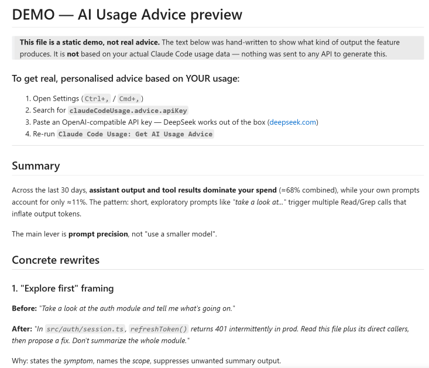

# Claude Code 使用量监控

🌐 **语言**: [🏠 Main](README.md) | [English](README-en.md) | [繁體中文](README-zh-TW.md) | **简体中文** | [日本語](README-ja.md) | [한국어](README-ko.md)

---

**看清你的 Claude Code 用量，让 AI 帮你用得更好。** 不是账单工具，不是多 provider 监控面板。一个专注于 token 精确归因、并用 AI 帮你优化使用习惯的轻量 VS Code 插件。

> **它是什么**：一个 VS Code 状态栏小工具，读取本地 Claude Code 对话日志，按 token × 公开单价估算用量与成本；并提供可选的 AI 建议功能，帮你优化提示词、减少不必要的 token 消耗。
>
> **它不是什么**：账单工具。显示金额均为估算值（基于公开的每百万 token 单价），实际费用请以 Anthropic 官方账单为准。

> 截图取自英文界面。

---

## 截图

### 状态栏


*今日成本 · 当前 session 成本 · 5 小时和每周配额利用率。*

将鼠标移到配额指示器上可看到明细：


*来自真实 `/usage` 数据 —— 利用率百分比、重置倒计时，以及每周重置的星期与时间。*

### 仪表板


*点击状态栏打开完整仪表板。堆叠成本构成图、小时分布、缓存命中率、按 token 类型的成本构成，以及下方的按模型 / 按日表格。*

### Content 标签页 —— 看清 token 究竟花在哪


*估算哪些内容消耗你的 token —— 你的提示 vs 工具结果（按工具）vs 助手输出 / 思考。这是优化使用的着力点，统计范围为近 30 天。*

### AI 建议（可选）



*可选的 AI 顾问，将你的用量汇总加上近期提示的样本发往 OpenAI 兼容 API（默认 DeepSeek V4 Pro），给出具体改写建议。需自备 key，或先点击 `Preview demo` 预览静态示例。*

---

## 2.0 新功能

- **真实的 5 小时和每周配额** 显示在状态栏 —— 读取 Claude Code 现有的 OAuth 会话（`~/.claude/.credentials.json`），无需配置。借鉴上游 [PR #9](https://github.com/jack21/ClaudeCodeUsage/pull/9)（[@Dobidop](https://github.com/Dobidop)）。
- **四个新标签页**：Sessions、Projects、Content、Branches，均可排序。
- **堆叠成本构成图**，含 Y 轴和参考线。
- **AI 建议命令**（默认 DeepSeek V4 Pro，`reasoning_effort=max`），未配置 key 时提供示例演示。
- **多厂商定价**：Opus 4.x、Sonnet 4.x、Haiku 4.5 对照 Anthropic 官方定价；OpenAI、Gemini、DeepSeek、Kimi、GLM、Qwen 等代理场景的参考价，含家族感知回退。`Refresh Token Pricing` 可拉取 LiteLLM 即时价格。
- **自定义时区** 用于日期显示（`claudeCodeUsage.timezone`）。
- **浅色主题标签可读性** 修复。
- 全程 **locale 感知的数字与日期**（德语用 `.`，英语用 `,`）。
- **实时状态栏**：基于 `fs.watch`（1.5s 防抖）+ 空闲跳过 + 非阻塞加载（每 25 个文件让出事件循环）。

完整变更：[CHANGELOG.md](CHANGELOG.md)。关闭上游 issue [#7](https://github.com/jack21/ClaudeCodeUsage/issues/7)、[#10](https://github.com/jack21/ClaudeCodeUsage/issues/10)、[#11](https://github.com/jack21/ClaudeCodeUsage/issues/11)、[#13](https://github.com/jack21/ClaudeCodeUsage/issues/13)。

---

## 安装

### VS Code Marketplace

在扩展视图（`Ctrl+Shift+X`）搜索 **`Claude Code Usage`**，或：

```
ext install GrowthJack.claude-code-usage
```

### Cursor / Windsurf / Antigravity（Open VSX）

同一扩展也发布在 [Open VSX Registry](https://open-vsx.org/extension/GrowthJack/claude-code-usage)。

### 从 `.vsix` 文件安装

`Ctrl+Shift+P` → **Extensions: Install from VSIX...** → 选择下载的 `.vsix`。

---

## 配置

打开设置（`Ctrl+,`）搜索 **`Claude Code Usage`**。所有设置均为可选，默认值在合理范围内保持上游行为。

| 设置 | 默认 | 作用 |
|---|---|---|
| `refreshInterval` | `60` | 刷新间隔（秒，最小 30）。 |
| `dataDirectory` | `""` | 自定义 Claude 数据目录；留空则自动检测。 |
| `language` | `"auto"` | 界面语言：`auto` / `en` / `zh-TW` / `zh-CN` / `ja` / `ko`。 |
| `decimalPlaces` | `2` | 成本显示的小数位（0–4）。 |
| `compactNumbers` | `false` | 用 `1.2M` / `345K` 代替完整数字。 |
| `timezone` | `""` | 日期显示用的 IANA 时区（如 `Asia/Hong_Kong`）。 |
| `usageLimitTracking` | `true` | 在状态栏显示真实 5h / 每周配额。 |
| `enableContentAnalysis` | `true` | 运行 Content 标签页的 token 分析。 |
| `projectGroupingMode` | `"git"` | Projects 标签分组：`git` / `folder` / `flat`。 |
| `pauseDashboardRefresh` | `false` | 暂停仪表板自动刷新（也可在仪表板标题栏切换）。 |
| `fileWatching` | `true` | 启用基于 `fs.watch` 的实时刷新；关闭则仅按间隔刷新。 |
| `advice.apiKey` | `""` | AI 建议功能的 API key（OpenAI 兼容）。 |
| `advice.apiUrl` | `https://api.deepseek.com/chat/completions` | chat-completions 端点。 |
| `advice.model` | `"deepseek-v4-pro"` | 模型名称。 |
| `advice.reasoningEffort` | `"max"` | 推理强度（DeepSeek V4：`high` / `max`）。 |

---

## 成本是如何计算的

状态栏成本为 **`Σ (tokens × 每百万单价)`**，覆盖输入、输出、缓存写入、缓存读取，并按模型汇总。

- **每百万单价** 来自内置定价表，对照 Anthropic 官方定价页验证，并为可能出现在代理场景的非 Anthropic 模型补充参考价。
- **`Refresh Token Pricing`**（命令 + 仪表板按钮）从 [LiteLLM 公开数据集](https://github.com/BerriAI/litellm)拉取即时价格作为运行时覆盖。
- **未知模型快照** 按其所属家族（Opus / Sonnet / Haiku / GPT / Gemini / DeepSeek / Kimi / GLM / Qwen）的当前档位定价，而非盲目回退。

状态栏**不知道**：

- 你实际的 Anthropic 账单（折扣、免费额度、套餐上限）。
- 你的代理供应商是否采用不同费率。
- 任何未记录在本地 `.jsonl` 日志中的内容。

**5h / 每周配额指示器**则不同 —— 它通过 OAuth 会话查询 Claude Code 真实的 `/usage` 端点，显示 Anthropic 为你的账户记录的实际百分比。该数值是权威的。

---

## 隐私

- 所有 token / 成本 / session 分析都在**本地**进行，读取你的 `~/.claude/projects/**/*.jsonl` 文件。
- 配额指示器用 Claude Code 现有的 OAuth token 调用 **`api.anthropic.com/api/oauth/usage`**，不发送任何额外凭证。
- **AI 建议命令** 是唯一会调用外部服务的功能 —— 且仅在*你*主动触发时。它将用量汇总加上近期提示样本发往你在 `advice.apiUrl` 配置的端点。**需自备 key**，扩展本身不附带任何 key。未配置 key 时，命令会打开一份手写示例，而不调用任何 API。

---

## 疑难排解

**"无 Claude Code 数据"**
- 确认 Claude Code 已安装并至少使用过一次。
- 检查 `dataDirectory` 设置；自动检测会查 `~/.claude/projects` 和 `~/.config/claude/projects`。

**配额行显示 `5h:--% wk:--%`**
- `~/.claude/.credentials.json` 中的 OAuth token 缺失或过期。登录 Claude Code 一次即可；扩展以只读方式读取凭证文件，并在需要时刷新 bearer。

**`Get AI Usage Advice` 返回 404**
- DeepSeek 当前端点**不**使用 `/v1` 前缀。请用 `https://api.deepseek.com/chat/completions`。扩展会自动剥除多余的 `/v1`。

**`Get AI Usage Advice` 显示示例而非真实建议**
- 说明未在 `claudeCodeUsage.advice.apiKey` 配置 API key。示例文件名带 `…-DEMO-…` 标记并有醒目横幅。在设置中填入 key 后重新运行命令。

**大历史下刷新缓慢**
- 2.0 每 25 个文件让出一次事件循环；空闲时跳过重算。如仍有问题，提高 `refreshInterval` 或将 `enableContentAnalysis` 设为 `false`。

**历史记录消失或缺少早期月份**
- Claude Code 会自动删除超过 `cleanupPeriodDays`（默认 **30 天**）的对话日志。已删除的记录无法恢复。要保留更多历史，在 `~/.claude/settings.json` 中添加：
  ```json
  { "cleanupPeriodDays": 365 }
  ```
  此设置仅对之后生成的日志有效。感谢 [@nickearnshaw](https://github.com/nickearnshaw)（[PR #21](https://github.com/jack21/ClaudeCodeUsage/pull/21)）记录此项。

**Token 数量低于模型提供商后台**
- 如果你通过第三方代理使用 Claude Code，且请求经由 sub-agent 或后台 workflow（如 ultracode / 动态工作流），每个 agent 会在子目录写入独立的 `.jsonl` 文件。扩展会读取所有这些文件，但部分代理配置可能根本不写 agent 级记录。在未来版本加入原生工作流归因之前，此处显示的总量可能低于供应商的上游统计。实际消费始终以你的供应商账单页面为准。

---

## 致谢

Fork 自 [`jack21/ClaudeCodeUsage`](https://github.com/jack21/ClaudeCodeUsage)。MIT 授权。

- [@Dobidop](https://github.com/Dobidop) —— [PR #9](https://github.com/jack21/ClaudeCodeUsage/pull/9)，读取真实 `/usage` 数据的 OAuth 方案。本版配额指示器借鉴自该工作。
- [@nickearnshaw](https://github.com/nickearnshaw) —— [PR #8](https://github.com/jack21/ClaudeCodeUsage/pull/8) locale 感知的数字/日期格式；[PR #20](https://github.com/jack21/ClaudeCodeUsage/pull/20) 修复 webview/状态栏卡在 "Loading…"（重入保护 + 仅冷启动显示加载动画）；[PR #21](https://github.com/jack21/ClaudeCodeUsage/pull/21) 关于 `cleanupPeriodDays` 的文档。
- [@brenoneill](https://github.com/brenoneill) —— [PR #14](https://github.com/jack21/ClaudeCodeUsage/pull/14)，自定义数据目录（已并入上游 1.0.8）。
- [@mxzinke](https://github.com/mxzinke) —— Opus 4.5 / Haiku 4.5 价格 + 德语翻译（上游 1.0.8）。

本 fork 中许多代码改动由 [Claude Code](https://claude.com/claude-code) 协助起草（commit 含 `Co-Authored-By: Claude <noreply@anthropic.com>`）。

**欢迎提出 Issue、PR 与想法** —— 这正是项目成长的方式。

---

## 许可证

[MIT](LICENSE)
